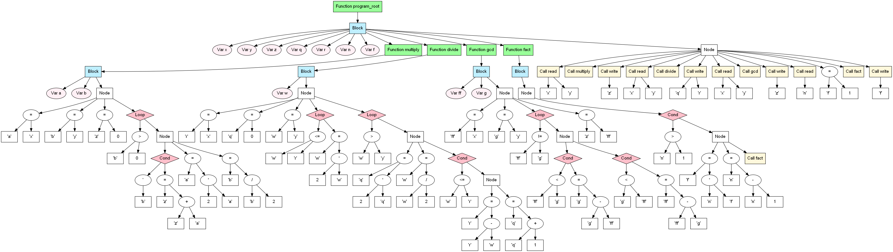
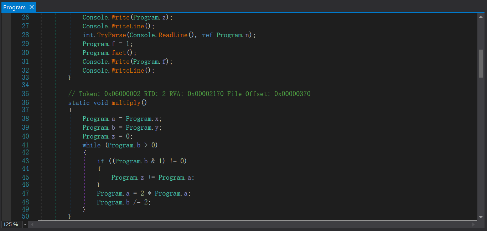

# PL/0 to IL compiler

This is a course related practice project, and may never maintenance :(

For more information about PL/0,check out the page in [wikipedia](https://en.wikipedia.org/wiki/PL/0)


## Notice

### input & output synatx

```

statement = [ ident ":=" expression | "call" ident 

              | "?" ident | "!" expression 
							
              | "read(" ident { "," ident } ")" | "write(" expression  { "," expression } ")" 
							
              | "begin" statement {";" statement } "end" 
							
              | "if" condition "then" statement 
							
              | "while" condition "do" statement ]. 
```

### unimplemented
							
For now, all variables declared in the description are treated as global fields,


## Example

The code below is modified from the example in [wikipedia](https://en.wikipedia.org/wiki/PL/0), which was orginally taken from the second edition of Wirth's book Compilerbau, which appeared in 1986 in Germany. 


```pl/0

VAR x, y, z, q, r, n, f;

PROCEDURE multiply;
VAR a, b;
BEGIN
  a := x;
  b := y;
  z := 0;
  WHILE b > 0 DO
  BEGIN
    IF ODD b THEN z := z + a;
    a := 2 * a;
    b := b / 2
  END
END;

PROCEDURE divide;
VAR w;
BEGIN
  r := x;
  q := 0;
  w := y;
  WHILE w <= r DO w := 2 * w;
  WHILE w > y DO
  BEGIN
    q := 2 * q;
    w := w / 2;
    IF w <= r THEN
    BEGIN
      r := r - w;
      q := q + 1
    END
  END
END;

PROCEDURE gcd;
VAR ff, g;
BEGIN
  ff := x;
  g := y;
  WHILE ff # g DO
  BEGIN
    IF ff < g THEN g := g - ff;
    IF g < ff THEN ff := ff - g
  END;
  z := ff
END;

PROCEDURE fact;
BEGIN
  IF n > 1 THEN
  BEGIN
    f := n * f;
    n := n - 1;
    CALL fact
  END
END;

BEGIN
  read(x,y); CALL multiply; write(z);
  read(x,y); CALL divide; write(q,r);
  read(x,y); CALL gcd; write(z);
  read(n); f := 1; CALL fact; write(f);
END.

```

TreeDot output:

rendered by [graphviz](https://graphviz.gitlab.io/about/)



IL output:

```il
.assembly extern mscorlib {}
.assembly PLProgram {}
.module PLProgram.exe
.class PLProgram.Program
extends [mscorlib]System.Object
{
.field public static int32 f 
.field public static int32 n 
.field public static int32 r 
.field public static int32 x 
.field public static int32 y 
.field public static int32 z 
.field public static int32 q 
.method static void Main(string[] args) cil managed 
{
    .entrypoint
    .locals init (
    [0] int32&,
    [1] int32&,
    [2] int32&,
    [3] int32&,
    [4] int32&,
    [5] int32&,
    [6] int32&
    )
    ldsflda int32 PLProgram.Program::x
    stloc 0
    call string [mscorlib]System.Console::ReadLine()
    ldloc 0
    call bool [mscorlib]System.Int32::TryParse(string, int32&)
    pop 
    ldsflda int32 PLProgram.Program::y
    stloc 1
    call string [mscorlib]System.Console::ReadLine()
    ldloc 1
    call bool [mscorlib]System.Int32::TryParse(string, int32&)
    pop 
    call void PLProgram.Program::multiply()
    ldsfld int32 PLProgram.Program::z
    call void [mscorlib]System.Console::Write(int32)
    call void [mscorlib]System.Console::WriteLine()
    ldsflda int32 PLProgram.Program::x
    stloc 2
    call string [mscorlib]System.Console::ReadLine()
    ldloc 2
    call bool [mscorlib]System.Int32::TryParse(string, int32&)
    pop 
    ldsflda int32 PLProgram.Program::y
    stloc 3
    call string [mscorlib]System.Console::ReadLine()
    ldloc 3
    call bool [mscorlib]System.Int32::TryParse(string, int32&)
    pop 
    call void PLProgram.Program::divide()
    ldsfld int32 PLProgram.Program::q
    call void [mscorlib]System.Console::Write(int32)
    call void [mscorlib]System.Console::WriteLine()
    ldsfld int32 PLProgram.Program::r
    call void [mscorlib]System.Console::Write(int32)
    call void [mscorlib]System.Console::WriteLine()
    ldsflda int32 PLProgram.Program::x
    stloc 4
    call string [mscorlib]System.Console::ReadLine()
    ldloc 4
    call bool [mscorlib]System.Int32::TryParse(string, int32&)
    pop 
    ldsflda int32 PLProgram.Program::y
    stloc 5
    call string [mscorlib]System.Console::ReadLine()
    ldloc 5
    call bool [mscorlib]System.Int32::TryParse(string, int32&)
    pop 
    call void PLProgram.Program::gcd()
    ldsfld int32 PLProgram.Program::z
    call void [mscorlib]System.Console::Write(int32)
    call void [mscorlib]System.Console::WriteLine()
    ldsflda int32 PLProgram.Program::n
    stloc 6
    call string [mscorlib]System.Console::ReadLine()
    ldloc 6
    call bool [mscorlib]System.Int32::TryParse(string, int32&)
    pop 
    ldc.i4 1
    stsfld int32 PLProgram.Program::f
    call void PLProgram.Program::fact()
    ldsfld int32 PLProgram.Program::f
    call void [mscorlib]System.Console::Write(int32)
    call void [mscorlib]System.Console::WriteLine()
    ret
}
.field public static int32 b 
.field public static int32 a 
.method static void multiply() 
{
    .locals init (
    [0] int32,
    [1] int32,
    [2] int32,
    [3] int32,
    [4] int32
    )
    ldsfld int32 PLProgram.Program::x
    stsfld int32 PLProgram.Program::a
    ldsfld int32 PLProgram.Program::y
    stsfld int32 PLProgram.Program::b
    ldc.i4 0
    stsfld int32 PLProgram.Program::z
    br L1
L2:
    ldsfld int32 PLProgram.Program::b
    ldc.i4.1 
    and 
    brtrue L4
    br L3
L4:
    ldsfld int32 PLProgram.Program::z
    ldsfld int32 PLProgram.Program::a
    add 
    stsfld int32 PLProgram.Program::z
L3:
    ldc.i4 2
    ldsfld int32 PLProgram.Program::a
    mul 
    stsfld int32 PLProgram.Program::a
    ldsfld int32 PLProgram.Program::b
    ldc.i4 2
    div 
    stsfld int32 PLProgram.Program::b
L1:
    ldsfld int32 PLProgram.Program::b
    ldc.i4 0
    cgt 
    brtrue L2
    ret
}
.field public static int32 w 
.method static void divide() 
{
    .locals init (
    [0] int32,
    [1] int32,
    [2] int32,
    [3] int32,
    [4] int32,
    [5] int32,
    [6] int32,
    [7] int32
    )
    ldsfld int32 PLProgram.Program::x
    stsfld int32 PLProgram.Program::r
    ldc.i4 0
    stsfld int32 PLProgram.Program::q
    ldsfld int32 PLProgram.Program::y
    stsfld int32 PLProgram.Program::w
    br L1
L2:
    ldc.i4 2
    ldsfld int32 PLProgram.Program::w
    mul 
    stsfld int32 PLProgram.Program::w
L1:
    ldsfld int32 PLProgram.Program::w
    ldsfld int32 PLProgram.Program::r
    cgt 
    ldc.i4.1 
    xor 
    brtrue L2
    br L3
L4:
    ldc.i4 2
    ldsfld int32 PLProgram.Program::q
    mul 
    stsfld int32 PLProgram.Program::q
    ldsfld int32 PLProgram.Program::w
    ldc.i4 2
    div 
    stsfld int32 PLProgram.Program::w
    ldsfld int32 PLProgram.Program::w
    ldsfld int32 PLProgram.Program::r
    cgt 
    ldc.i4.1 
    xor 
    brtrue L6
    br L5
L6:
    ldsfld int32 PLProgram.Program::r
    ldsfld int32 PLProgram.Program::w
    sub 
    stsfld int32 PLProgram.Program::r
    ldsfld int32 PLProgram.Program::q
    ldc.i4 1
    add 
    stsfld int32 PLProgram.Program::q
L5:
L3:
    ldsfld int32 PLProgram.Program::w
    ldsfld int32 PLProgram.Program::y
    cgt 
    brtrue L4
    ret
}
.field public static int32 g 
.field public static int32 ff 
.method static void gcd() 
{
    .locals init (
    [0] int32,
    [1] int32,
    [2] int32,
    [3] int32,
    [4] int32
    )
    ldsfld int32 PLProgram.Program::x
    stsfld int32 PLProgram.Program::ff
    ldsfld int32 PLProgram.Program::y
    stsfld int32 PLProgram.Program::g
    br L1
L2:
    ldsfld int32 PLProgram.Program::ff
    ldsfld int32 PLProgram.Program::g
    clt 
    brtrue L4
    br L3
L4:
    ldsfld int32 PLProgram.Program::g
    ldsfld int32 PLProgram.Program::ff
    sub 
    stsfld int32 PLProgram.Program::g
L3:
    ldsfld int32 PLProgram.Program::g
    ldsfld int32 PLProgram.Program::ff
    clt 
    brtrue L6
    br L5
L6:
    ldsfld int32 PLProgram.Program::ff
    ldsfld int32 PLProgram.Program::g
    sub 
    stsfld int32 PLProgram.Program::ff
L5:
L1:
    ldsfld int32 PLProgram.Program::ff
    ldsfld int32 PLProgram.Program::g
    ceq 
    ldc.i4.1 
    xor 
    brtrue L2
    ldsfld int32 PLProgram.Program::ff
    stsfld int32 PLProgram.Program::z
    ret
}
.method static void fact() 
{
    .locals init (
    [0] int32,
    [1] int32,
    [2] int32
    )
    ldsfld int32 PLProgram.Program::n
    ldc.i4 1
    cgt 
    brtrue L2
    br L1
L2:
    ldsfld int32 PLProgram.Program::n
    ldsfld int32 PLProgram.Program::f
    mul 
    stsfld int32 PLProgram.Program::f
    ldsfld int32 PLProgram.Program::n
    ldc.i4 1
    sub 
    stsfld int32 PLProgram.Program::n
    call void PLProgram.Program::fact()
L1:
    ret
}
}

```

Use ilasm to compile and try something like [dnSpy](https://github.com/0xd4d/dnSpy) :



